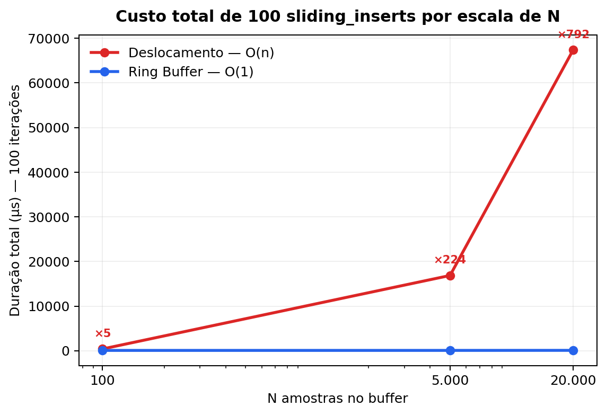
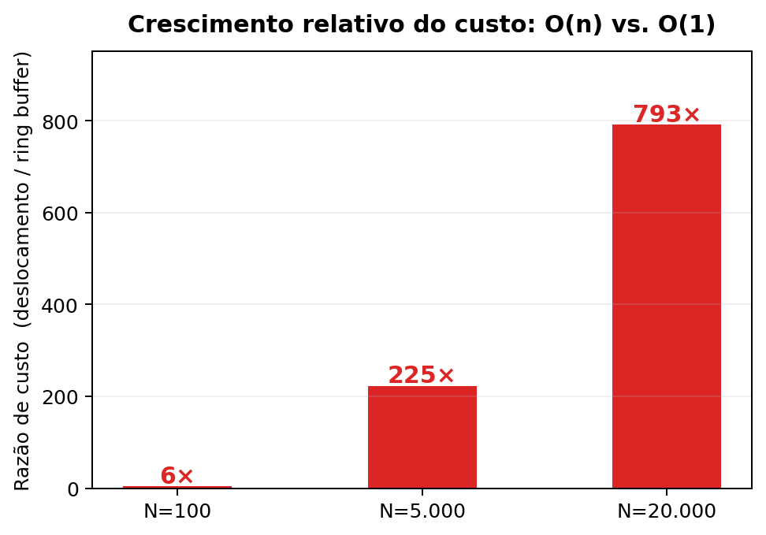
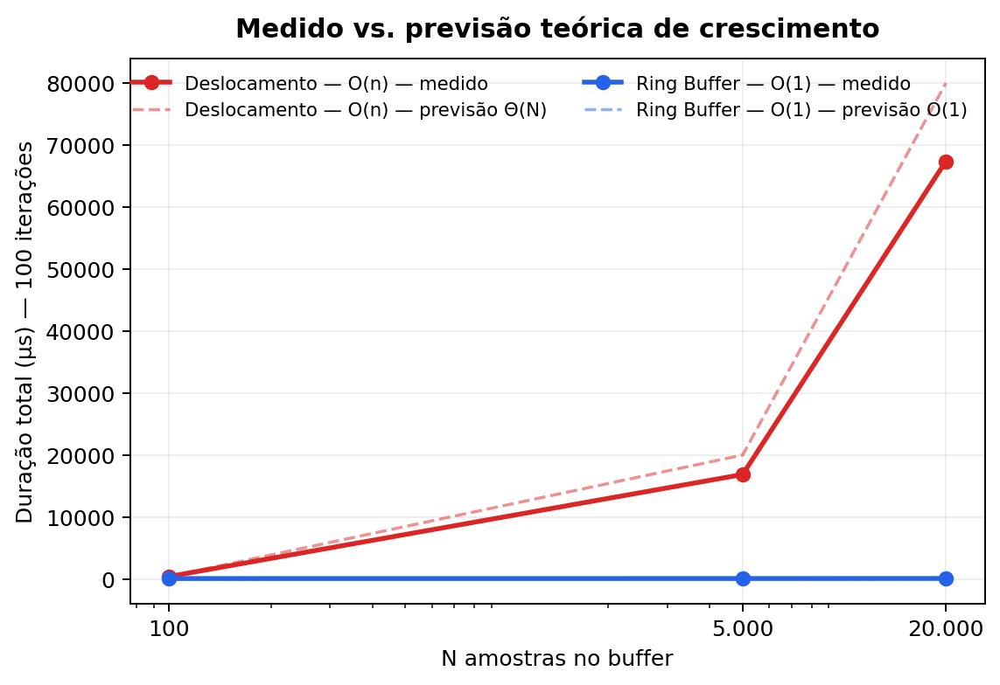
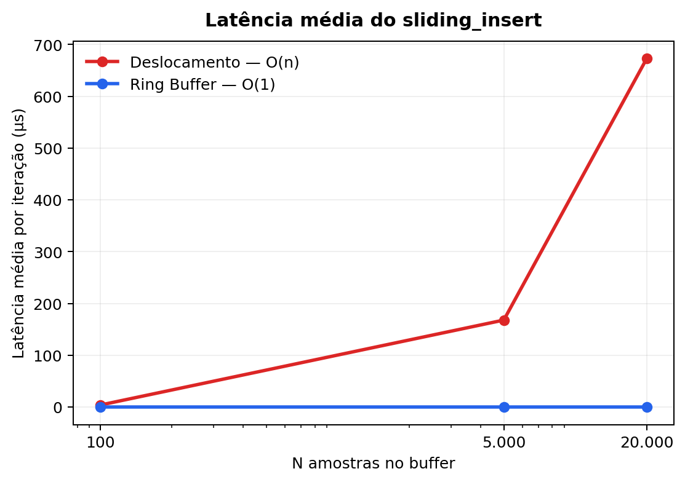
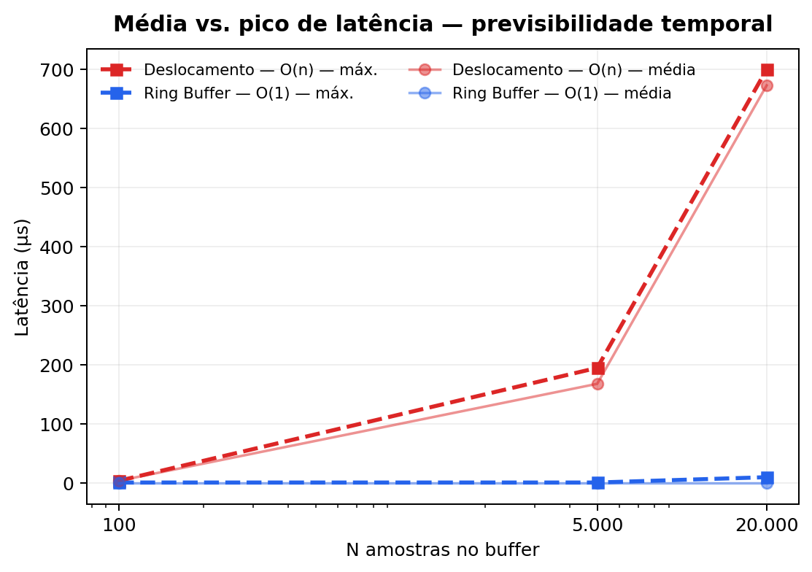

# Relatório de Perfilamento e Análise

**Projeto:** Otimização de Telemetria com Buffer Circular  
**Disciplina:** Análise de Algoritmos e Sistemas Embarcados  
**Sistema analisado:** Hand Rehab MVP  
**Execução de referência:** `762ba7a6-41a5-42ee-99fa-b5a1c23023f6`, 2026-06-04


## 1. Objetivo

Este relatório apresenta o perfilamento de duas estratégias para captura, armazenamento temporário e transmissão de amostras de sensores em um sistema embarcado com comunicação MQTT. O objetivo é contrastar empiricamente, em execução real sobre ESP32, o comportamento de uma abordagem baseada em deslocamento linear de elementos, denominada Vertente 1, com uma abordagem baseada em buffer circular de tamanho fixo, denominada Vertente 2.

A análise cobre quatro dimensões: a complexidade assintótica formal das operações derivada diretamente do código implementado, o comportamento observado sob diferentes escalas de `N`, o impacto sobre o uso de memória heap durante a execução e a resposta do sistema a variações de carga. Os dados empíricos apresentados foram obtidos a partir de uma execução persistida no PostgreSQL do MVP, nas tabelas `benchmark_runs` e `benchmark_results`, com identificador `762ba7a6-41a5-42ee-99fa-b5a1c23023f6`, garantindo rastreabilidade e conferência direta dos resultados.


## 2. Contextualização do Problema

Em sistemas embarcados como o ESP32, a assimetria temporal entre produção e consumo de dados constitui um problema estrutural. A leitura local de sensores pode ocorrer na escala de dezenas de microssegundos, enquanto a transmissão via MQTT envolve negociação de conexão Wi-Fi, enfileiramento no broker Aedes, roteamento no Node-RED, processamento no backend FastAPI e persistência no PostgreSQL. Essas operações facilmente atingem dezenas ou centenas de milissegundos. Essa diferença de escala, de três a quatro ordens de magnitude, impõe a necessidade de uma estrutura intermediária capaz de absorver amostras localmente enquanto a transmissão ocorre de forma assíncrona.

No MVP Hand Rehab, essa assimetria se manifesta diretamente na organização em tarefas FreeRTOS. As tarefas `taskButtons` e `taskPressure` capturam eventos dos quatro botões físicos, com `attachInterrupt` e debounce por software, e do sensor de pressão HX710B, inserindo cada amostra no buffer local imediatamente após a captura. A tarefa `taskBatchPublish` consome os dados acumulados e os transmite em lote via MQTT conforme a disponibilidade de rede. O buffer entre essas duas tarefas é o componente crítico: sua eficiência determina se a captura local permanece previsível mesmo quando a transmissão sofre variações.

O problema analisado, portanto, não é apenas "guardar amostras". O ponto é manter a captura previsível enquanto outras partes do sistema, principalmente rede e persistência, operam em ritmos mais lentos. A estratégia por deslocamento remove o elemento mais antigo copiando todos os demais uma posição para a esquerda. Esse custo cresce linearmente com o número de elementos armazenados e se repete a cada inserção após o preenchimento do buffer. Sob alta ocupação, situação que ocorre naturalmente durante atrasos de rede, o custo de CPU aumenta proporcionalmente e introduz jitter temporal. O buffer circular, por outro lado, reutiliza posições já alocadas: quando chega ao fim da área reservada, volta ao início lógico do buffer e continua escrevendo sem reorganizar os dados antigos.


## 3. Estruturas Implementadas

### 3.1 Vertente 1: InefficientShiftBuffer

A estrutura comparativa está implementada em `src/buffering/inefficient_buffer.h`. Sua regra de funcionamento é simples: para remover a amostra mais antiga, a posição inicial do vetor precisa ser liberada; para isso, cada item restante é copiado uma posição para a esquerda.

Essa decisão cria o custo linear da Vertente 1. Se o buffer contém `N` elementos, a remoção exige aproximadamente `N - 1` cópias. O conteúdo das amostras não muda esse comportamento, porque a estrutura sempre precisa reorganizar a janela inteira para manter o primeiro elemento na posição zero. A operação `sliding_insert`, que remove a amostra antiga e adiciona uma nova para manter a janela com tamanho fixo, passa a custar `Θ(N)` por ciclo.

### 3.2 Vertente 2: RingBuffer

A estrutura eficiente está implementada em `src/buffering/ring_buffer.h`. Ela reserva uma área fixa de memória e trata essa área como um ciclo: depois da última posição, a próxima escrita volta para a primeira posição disponível. Assim, remover uma amostra não exige puxar todos os elementos para frente. Basta marcar que a próxima leitura começa em outra posição.

Esse detalhe muda o comportamento do algoritmo. Na Vertente 1, manter a ordem visual do vetor custa cópias sucessivas. Na Vertente 2, a ordem passa a ser lógica: o firmware sabe onde começa a fila e onde a próxima amostra será escrita. Como atualizar esses marcadores sempre exige a mesma quantidade de trabalho, o custo do `sliding_insert` completo, isto é, remover uma amostra antiga e inserir uma nova, permanece `O(1)` mesmo quando `N` cresce.

O buffer circular também registra descartes quando não há espaço para novas amostras. Esse dado segue no payload de performance e permite verificar se houve perda durante a execução.

No MVP, dois buffers circulares são instanciados em produção: `buttonRingBuffer` para os eventos dos botões e `pressureRingBuffer` para as leituras do HX710B.


## 4. Instrumentação e Execução de Referência

### 4.1 Instrumentação do firmware

O firmware mede a latência de cada operação com `micros()` e registra o estado da memória com `ESP.getFreeHeap()` e `ESP.getMinFreeHeap()`, conforme o padrão:

```cpp
unsigned long start = micros();
// Lógica de inserção de dados
unsigned long duration = micros() - start;

Serial.printf("Latência: %lu µs | Heap Livre: %u bytes\n",
              duration, ESP.getFreeHeap());
```

Esses valores são agregados no objeto `performance` de cada payload batch, que inclui `insert_latency_us_avg`, `insert_latency_us_max`, `mqtt_publish_latency_us`, `free_heap_bytes`, `min_free_heap_bytes`, `buffer_capacity`, `buffer_used` e `dropped_samples`.

### 4.2 O que cada execução de benchmark testa

O sistema executa a operação `sliding_insert` repetidamente: dado um buffer já preenchido com `N` amostras, remove a mais antiga e insere uma nova, mantendo a janela de tamanho fixo. Esse padrão representa o comportamento real de produção: o firmware captura amostras continuamente e o buffer nunca esvazia completamente entre transmissões em sessões longas. São 100 iterações dessa operação por combinação de estratégia e escala, produzindo a duração total, a latência média e a latência máxima registradas por resultado.

O backend cria uma entrada em `benchmark_runs`, emite o comando via MQTT, o firmware executa os testes e publica os resultados no tópico `rehab/devices/{device_id}/benchmark/results`. O Node-RED normaliza o payload e o encaminha ao backend, que persiste os dados em `benchmark_results` no PostgreSQL. Esse fluxo exerce toda a pilha de comunicação do MVP, não apenas o algoritmo local.

### 4.3 Metadados da execução de referência

| Campo | Valor |
|---|---|
| `benchmark_runs.id` | `762ba7a6-41a5-42ee-99fa-b5a1c23023f6` |
| Dispositivo | `esp32-001` |
| Status | `completed` |
| Escalas avaliadas | `N=100`, `N=5.000`, `N=20.000` |
| Operação | `sliding_insert` |
| Iterações por resultado | 100 |
| Resultados esperados / recebidos | 6 / 6 |
| Início | `2026-06-04 15:22:50.786 UTC` |
| Fim | `2026-06-04 15:22:51.087 UTC` |
| Tópico de resultados | `rehab/devices/esp32-001/benchmark/results` |


## 5. Análise Assintótica

### 5.1 Inserção

No `RingBuffer`, a inserção escreve diretamente na próxima posição livre já reservada. Depois disso, a estrutura apenas atualiza qual será a próxima posição de escrita. Se a escrita chega ao fim da área reservada, ela volta ao início do ciclo. O ponto importante é que não há busca, cópia em massa nem reorganização da janela. O número de passos é o mesmo para `N=100` e para `N=20.000`:

```
T_push_ring(N) = c₁
T_push_ring(N) ∈ O(1)
```

No `InefficientShiftBuffer`, a inserção no final do vetor é igualmente `O(1)`. O custo linear surge inteiramente na remoção.

### 5.2 Remoção

No `RingBuffer`, a remoção segue a mesma lógica. A estrutura lê a próxima amostra disponível e atualiza o ponto de início da fila. Os demais elementos permanecem onde estão na memória. Mesmo com o buffer completamente cheio, a estrutura não precisa deslocar o restante da janela:

```
T_pop_ring(N) = c₂
T_pop_ring(N) ∈ O(1)
```

No `InefficientShiftBuffer`, a remoção executa uma cópia para cada elemento que precisa ser deslocado. Para um buffer com `N` elementos armazenados:

```
T_pop_shift(N) = a(N - 1) + b
T_pop_shift(N) ∈ Θ(N)
```

O símbolo `Θ` é preciso: o custo é linear tanto no melhor quanto no pior caso, pois a estrutura percorre todos os elementos que precisam ser reposicionados independentemente dos valores armazenados ou de qualquer outra condição.

### 5.3 Operação sliding_insert

A operação medida pela execução de referência combina remoção seguida de inserção. Para o `RingBuffer`:

```
T_slide_ring(N) = c₁ + c₂ = c
T_slide_ring(N) ∈ O(1)
```

Para o `InefficientShiftBuffer`, o custo linear da remoção domina a composição:

```
T_slide_shift(N) = c + a(N - 1) + b ≈ aN
T_slide_shift(N) ∈ Θ(N)
```

Para 100 iterações por escala, o custo total cresce como `100aN` na Vertente 1 contra uma constante `100c` na Vertente 2. O crescimento é linear em `N` para a Vertente 1 e independente de `N` para a Vertente 2. Essa diferença define a expectativa para a medição empírica: a abordagem por deslocamento deve crescer conforme a escala aumenta, enquanto o buffer circular deve permanecer próximo de uma linha estável.

### 5.4 Comparativo teórico

| Operação | Vertente 1: deslocamento | Vertente 2: buffer circular |
|---|---|---|
| push | `O(1)` | `O(1)` |
| pop | `Θ(N)` | `O(1)` |
| sliding_insert | `Θ(N)` | `O(1)` |
| 100 iterações sobre N | `Θ(100N)` | `Θ(100)` |
| Alocação em execução | Fixa (vetor estático) | Fixa (vetor estático) |
| Movimentação de memória por operação | `N - 1` cópias | Nenhuma |
| Previsibilidade temporal | Degrada com N | Constante |


## 6. Resultados Empíricos

Os resultados extraídos de `benchmark_results` para a execução `762ba7a6-41a5-42ee-99fa-b5a1c23023f6` permitem observar três aspectos complementares. A duração total mostra quanto tempo o firmware gastou para executar 100 atualizações da janela. A latência média mostra o custo típico de uma atualização individual. A latência máxima mostra o pior caso observado naquele conjunto, ou seja, o ponto em que o sistema ficaria mais próximo de introduzir atraso perceptível na amostragem.

Essas três métricas são importantes porque o problema não é apenas terminar uma operação. Em um sistema embarcado com sensores, o firmware precisa terminar a operação dentro de uma janela de tempo previsível. Uma estratégia pode parecer aceitável em média, mas ainda assim produzir picos de latência que atrasam a captura ou o envio do próximo lote.

| Estratégia | N | Duração total (µs) | Lat. média (µs) | Lat. máx. (µs) | Heap mín. (bytes) | Drops |
|---|---:|---:|---:|---:|---:|---:|
| `ring_buffer` | 100 | 72 | 0 | 1 | 86820 | 0 |
| `ring_buffer` | 5.000 | 75 | 0 | 1 | 86820 | 0 |
| `ring_buffer` | 20.000 | 85 | 0 | 10 | 86820 | 0 |
| `inefficient_shift_buffer` | 100 | 400 | 4 | 4 | 86820 | 0 |
| `inefficient_shift_buffer` | 5.000 | 16.862 | 168 | 195 | 86820 | 0 |
| `inefficient_shift_buffer` | 20.000 | 67.397 | 673 | 700 | 86820 | 0 |



**Figura 1.** Duração total das 100 iterações de `sliding_insert` em cada escala de `N`.

A Figura 1 representa o custo acumulado de manter a janela de amostras. O comportamento esperado para uma estrutura adequada é que esse custo não cresça de forma relevante quando `N` aumenta, pois a frequência de captura dos sensores não deveria depender do tamanho do histórico mantido. É exatamente isso que ocorre com o buffer circular: os valores ficam praticamente estáveis. Já a abordagem por deslocamento cresce junto com `N`, o que indica que o firmware passa a gastar tempo reorganizando memória em vez de apenas registrar a nova amostra.

### 6.1 Crescimento observado e validação teórica

A razão entre as durações totais das duas estratégias para cada escala:

| N | Vertente 2 (µs) | Vertente 1 (µs) | Razão V1/V2 |
|---:|---:|---:|---:|
| 100 | 72 | 400 | 5,6× |
| 5.000 | 75 | 16.862 | 224,8× |
| 20.000 | 85 | 67.397 | 792,9× |



**Figura 2.** Razão entre o custo da Vertente 1 e o custo da Vertente 2.

A Figura 2 resume a diferença prática entre as duas escolhas de estrutura. Em `N=100`, a abordagem por deslocamento já custa mais de cinco vezes o buffer circular, mas esse valor ainda poderia parecer pequeno em termos absolutos. A mudança relevante aparece quando a escala aumenta: em `N=20.000`, o mesmo padrão de operação passa a custar quase 793 vezes mais. Esse crescimento mostra que a Vertente 1 não é apenas menos eficiente; ela fica progressivamente pior justamente nos cenários em que o buffer é mais necessário.

A previsão teórica para a Vertente 1 é crescimento linear em `N`. Entre `N=100` e `N=5.000`, o fator é 50×; a duração esperada seria `400 µs × 50 = 20.000 µs`. O valor medido foi `16.862 µs`, coerente com a previsão dentro das variações de microarquitetura do ESP32. Entre `N=100` e `N=20.000`, o fator é 200×; a duração esperada seria `80.000 µs`. O valor medido foi `67.397 µs`, também compatível com o regime linear.

A Vertente 2 registrou durações de `72 µs`, `75 µs` e `85 µs` para `N=100`, `N=5.000` e `N=20.000`. A variação absoluta de `13 µs` num intervalo em que `N` cresce 200× é incompatível com crescimento algorítmico relevante. Ela reflete variações normais de execução no processador, confirmando o comportamento `O(1)`.



**Figura 3.** Comparação entre os valores medidos na ESP32 e as curvas teóricas esperadas: `Θ(N)` para deslocamento e `O(1)` para buffer circular.

A Figura 3 conecta a análise matemática com a medição real. A linha da Vertente 1 acompanha a tendência linear prevista, ainda que os valores não coincidam exatamente com a curva ideal. Essa diferença é normal em hardware real, pois cache, interrupções e escalonamento do FreeRTOS interferem nas medições. O ponto central é que a direção do crescimento é a mesma da teoria. A Vertente 2, por sua vez, permanece quase horizontal, que é o sinal esperado quando a operação não depende do tamanho da janela.

### 6.2 Latência por iteração

A latência média por iteração na Vertente 1 foi `4 µs` para `N=100`, `168 µs` para `N=5.000` e `673 µs` para `N=20.000`. A razão entre `N=5.000` e `N=100` é 42×, e entre `N=20.000` e `N=100` é 168×. Esses valores são próximos dos fatores de escala de `N` (50× e 200×), confirmando que a latência por operação cresce linearmente com o tamanho do buffer.



**Figura 4.** Latência média por iteração de `sliding_insert`.

A Figura 4 mostra o custo típico de uma atualização individual. Para a Vertente 1, a média sobe de `4 µs` para `673 µs` conforme `N` cresce. Isso significa que uma única atualização da janela passa a ocupar muito mais tempo de CPU. Para a Vertente 2, a média arredondada pelo firmware permanece em `0 µs`, o que indica que o custo ficou abaixo da resolução prática registrada para a média nessa execução.

A latência máxima na Vertente 1 foi `4 µs`, `195 µs` e `700 µs`, respectivamente. A diferença entre média e máximo em `N=5.000` (`168 µs` vs `195 µs`) evidencia jitter: algumas iterações foram mais custosas que a média, provavelmente por interrupções do FreeRTOS ou variações de acesso à SRAM durante o deslocamento. Na Vertente 2, a latência máxima não superou `10 µs` mesmo em `N=20.000`, demonstrando a previsibilidade temporal que o buffer circular oferece ao firmware.



**Figura 5.** Comparação entre média e pico de latência, destacando o jitter da abordagem por deslocamento.

A Figura 5 ajuda a interpretar o risco operacional. O pico de `700 µs` na Vertente 1 em `N=20.000` não é apenas um número maior; ele representa um momento em que a tarefa de buffer monopoliza mais tempo do processador antes de devolver controle ao restante do firmware. Em aplicações com captura contínua, esses picos são mais perigosos que a média, porque podem se acumular com atrasos de rede, interrupções e outras tarefas do sistema. O buffer circular reduz esse risco ao manter picos baixos mesmo com a janela maior.


## 7. Diagnóstico de Memória

### 7.1 Comportamento das estruturas

O `RingBuffer` reserva sua área de armazenamento uma única vez na inicialização. Durante a execução, inserir, remover ou descartar amostras não exige novas alocações. Isso elimina pressão adicional sobre o heap durante as operações de buffer e torna o consumo de memória previsível ao longo de uma sessão.

O `InefficientShiftBuffer` da implementação comparativa também usa vetor estático, sem `realloc`. Essa escolha é deliberada para isolar o custo do deslocamento como variável independente. Uma implementação real com `realloc` frequente, que é o antipadrão descrito no enunciado, apresentaria impacto adicional: chamadas sucessivas fragmentariam o heap do ESP32, que dispõe de aproximadamente 320 KB de SRAM. Em sessões longas, essa fragmentação poderia inviabilizar novas alocações mesmo com bytes livres suficientes, porém não contíguos, eventualmente causando falhas de `malloc` ou comportamento indefinido.

### 7.2 Dados empíricos

Na execução de referência, o heap mínimo registrado foi idêntico para as seis combinações de estratégia e escala: `86.820 bytes`. Esse valor representa o piso de memória livre atingido durante a execução de cada teste, e sua uniformidade confirma que ambas as estruturas, na forma implementada com vetor estático, não exercem pressão diferencial sobre o alocador durante a fase de benchmark.

A diferença nas durações, e portanto no tempo que cada estrutura ocupa o processador, tem consequências indiretas para o heap em sessões reais. O FreeRTOS aloca estruturas internas nas tarefas ativas; quanto mais tempo a CPU passa em operações de buffer, menos ciclos sobram para o gerenciamento das filas de comunicação entre tarefas. Isso pode levar ao crescimento das filas internas e à pressão sobre o heap disponível para o runtime. Por esse motivo, o valor de heap mínimo não deve ser lido isoladamente: nesta execução ele ficou igual nas duas estratégias, mas a Vertente 1 manteve o processador ocupado por muito mais tempo.


## 8. Discussão: Resiliência a Variações de Rede

### 8.1 Arquitetura do fluxo de telemetria

O MVP organiza a comunicação em dois caminhos distintos:

```
Tempo real:   ESP32 → MQTT → Node-RED/Aedes → WebSocket → Frontend
Persistência: ESP32 → MQTT batch → Node-RED → FastAPI → PostgreSQL
```

O buffer de cada estratégia opera no caminho de persistência. A tarefa `taskBatchPublish` acumula amostras no buffer e as transmite em lote quando a rede está disponível. O buffer absorve a assimetria temporal entre a captura local e a publicação remota.

### 8.2 Acoplamento entre ocupação do buffer e custo algorítmico

Na Vertente 1, existe um acoplamento direto entre o estado de ocupação do buffer e o custo de inserção. Quando a rede sofre atrasos, a tarefa `taskBatchPublish` demora mais para consumir dados. Com o buffer mais ocupado, cada `sliding_insert` executa mais cópias no deslocamento. Com mais cópias, o tempo de CPU por inserção aumenta, potencialmente atrasando a própria captura dos sensores. Esse ciclo de retroalimentação negativa é:

```
atraso de rede
  → buffer mais ocupado (N efetivo maior)
    → custo de deslocamento maior por operação
      → mais tempo de CPU gasto pelo buffer
        → jitter na amostragem dos sensores
```

### 8.3 Isolamento oferecido pelo buffer circular

O `RingBuffer` interrompe esse ciclo na segunda etapa. Como inserir e remover têm custo `O(1)` independentemente do estado de ocupação, o atraso de rede não tem impacto mensurável sobre a latência de captura local. A única consequência de um buffer muito ocupado é o descarte de novas amostras, controlado e registrado na telemetria, sem degradação do custo de inserção.

### 8.4 Flush de sessão

Quando o backend publica o comando `end_session`, `taskBatchPublish` realiza o flush dos buffers pendentes antes de encerrar a sessão, garantindo que amostras capturadas mas não transmitidas não sejam perdidas. Na Vertente 2, esse flush opera com custo `O(1)` por elemento consumido, independentemente do volume acumulado. Na Vertente 1, esvaziar completamente um buffer com `K` elementos restantes exige `K - 1 + K - 2 + ... + 1 = K(K-1)/2` cópias, com custo `O(K²)`. Esse é o pior cenário da Vertente 1: encerramento após período de gargalo, quando o buffer está mais preenchido.

O campo `dropped_samples` na tabela `benchmark_results` registra eventuais descartes. Na execução de referência, todos os seis resultados registraram `dropped_samples = 0`, indicando que a cadeia de telemetria absorveu o volume gerado pelos testes sem perda. Ainda assim, o risco da Vertente 1 aparece no modelo de comportamento: a rede não precisa falhar completamente para afetar a captura; basta atrasar o consumo do buffer. Quando a ocupação cresce, o deslocamento fica mais caro, e esse custo adicional pode disputar tempo de CPU com as tarefas de amostragem.


## 9. Limitações

A execução de referência está baseada em uma única run completa, sem repetições controladas em sessões diferentes. Os valores de latência e heap refletem as condições específicas desse momento de execução, como temperatura do dispositivo, estado do FreeRTOS e qualidade da conexão Wi-Fi, e não permitem calcular intervalos de confiança estatísticos.

A execução de referência não incluiu simulação explícita de gargalo de rede. O comportamento sob instabilidade foi discutido com base na análise do código e do modelo de custo, não de medições diretas com latência de rede controlada. Uma extensão relevante seria executar o benchmark em condições de Wi-Fi degradado e correlacionar a ocupação do buffer com a variação na latência das operações.

A fragmentação real do heap por `realloc` frequente não foi induzida, pois ambas as estruturas utilizam vetor estático. O diagnóstico de memória apresentado é parcialmente teórico nesse ponto: os efeitos de uma implementação com alocação dinâmica real seriam mais severos do que os observados.

A série temporal de cada uma das 100 iterações por resultado não está disponível nas tabelas `benchmark_results`. Apenas os agregados de duração total, latência média e latência máxima foram persistidos. Uma granularidade maior permitiria análise de distribuição de latências e detecção de outliers por iteração. Dessa forma, a run usada demonstra o comportamento esperado das duas estruturas e permite conferência no banco, mas não caracteriza estatisticamente todo o ambiente de produção.


## 10. Conclusão

A análise demonstra, de forma convergente entre a teoria assintótica e os dados empíricos da execução `762ba7a6-41a5-42ee-99fa-b5a1c23023f6`, que o buffer circular é a estratégia adequada para o contexto de telemetria do MVP Hand Rehab.

Do ponto de vista assintótico, o comportamento das duas estruturas confirma sem ambiguidade a diferença de complexidade. A Vertente 1 precisa deslocar os elementos restantes a cada remoção, resultando em custo `Θ(N)` por `sliding_insert`. A Vertente 2 apenas muda os pontos lógicos de leitura e escrita, resultando em `O(1)` independentemente de `N` ou ocupação do buffer.

Os dados do hardware real validam essa previsão. Entre `N=100` e `N=20.000`, a duração total da Vertente 1 cresceu de `400 µs` para `67.397 µs`, fator de 168×, coerente com o crescimento teórico de 200× considerando as variações de microarquitetura do ESP32. A Vertente 2, no mesmo intervalo, passou de `72 µs` para `85 µs`, variação de 18% que não representa crescimento algorítmico. A razão de custo entre as duas estratégias em `N=20.000` é de 792×.

A latência máxima de `700 µs` da Vertente 1 em `N=20.000`, contra `10 µs` da Vertente 2, evidencia o jitter temporal que compromete a previsibilidade da amostragem. Em uma aplicação de reabilitação motora, onde a consistência temporal da captura tem impacto direto na qualidade do feedback ao paciente, esse comportamento é inaceitável em produção.

O `RingBuffer` atende aos requisitos de previsibilidade temporal, estabilidade de memória e resiliência a variações de rede. Recomenda-se mantê-lo como estrutura principal de telemetria do MVP, preservando o `InefficientShiftBuffer` apenas como referência comparativa acadêmica, sem instâncias ativas em sessões de reabilitação.


## 11. Reprodução

Os gráficos incluídos neste relatório foram gerados com uma venv local:

```bash
python3 -m venv .venv
.venv/bin/python -m pip install matplotlib
MPLCONFIGDIR=/tmp/matplotlib-cache .venv/bin/python entregas/perfilamento/build_real_report_assets.py
```

Com os containers do MVP ativos:

```bash
docker compose exec postgres psql -U rehab_user -d postgres \
  -c "SELECT * FROM benchmark_runs WHERE id = '762ba7a6-41a5-42ee-99fa-b5a1c23023f6';"

docker compose exec postgres psql -U rehab_user -d postgres \
  -c "SELECT * FROM benchmark_results WHERE run_id = '762ba7a6-41a5-42ee-99fa-b5a1c23023f6' ORDER BY strategy, sample_count;"
```

Para executar uma nova run de benchmark, o backend deve criar uma entrada em `benchmark_runs`, emitir o comando via MQTT e aguardar a persistência em `benchmark_results`. A execução `762ba7a6-41a5-42ee-99fa-b5a1c23023f6` deve ser preservada como referência verificável dos resultados apresentados neste relatório.
