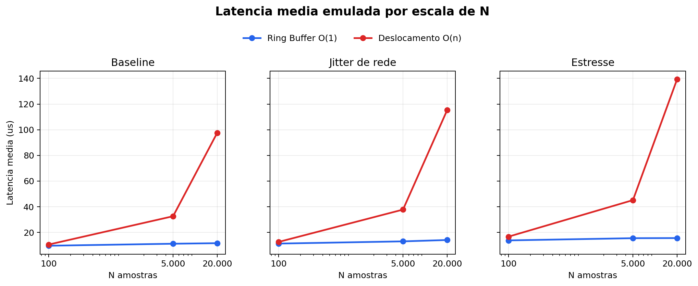
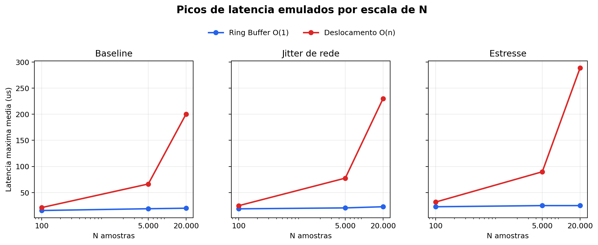
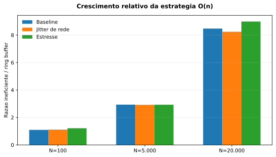
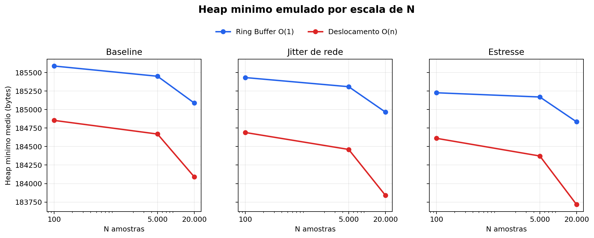
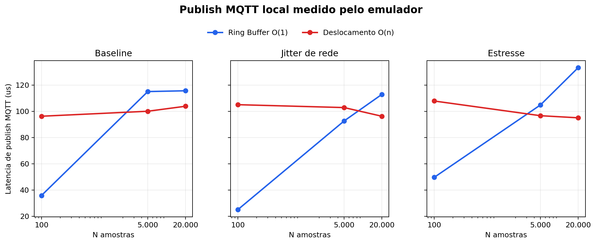
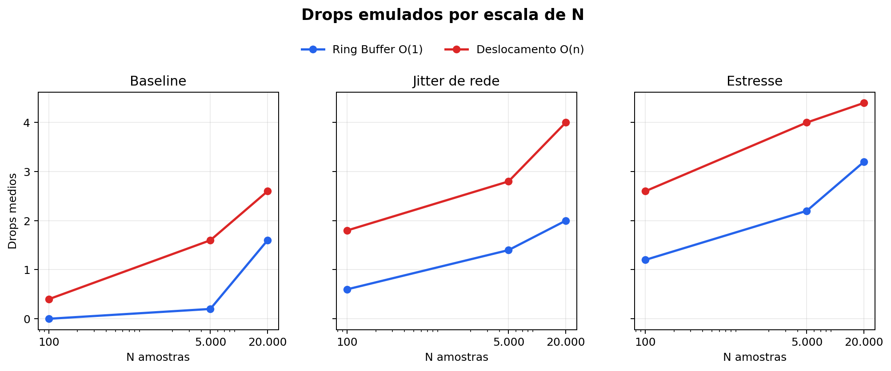

# Relatório de Perfilamento e Análise

Projeto: Otimização de Telemetria com Buffer Circular  
Disciplina: Análise de Algoritmos e Sistemas Embarcados  
Sistema analisado: Hand Rehab MVP  
Data da campanha: 2026-06-03

## 1. Objetivo

Este relatório documenta o perfilamento de duas estratégias para captura, armazenamento temporário e transmissão de amostras de sensores em um sistema embarcado com comunicação MQTT.

O objetivo é contrastar a Vertente 1, baseada em deslocamento linear de elementos, com a Vertente 2, baseada em buffer circular de tamanho fixo. A comparação segue o requisito de AA: avaliar complexidade assintótica, comportamento sob escalas crescentes de `N`, impacto de memória e resposta sob gargalo de rede.

Como a ESP32 física não estava disponível para a campanha final, os tempos de algoritmo foram emulados de forma determinística. Ainda assim, os payloads foram publicados no broker MQTT real do projeto, roteados pelo Node-RED, recebidos pelo backend e persistidos no Postgres. Portanto, os números de algoritmo devem ser lidos como emulação controlada, enquanto o fluxo de telemetria MQTT foi exercitado de ponta a ponta.

## 2. Contextualização do Problema

Em sistemas embarcados como a ESP32, a captura local de eventos pode ocorrer em microssegundos, enquanto a transmissão de rede opera em milissegundos. Essa diferença de escala cria risco de acúmulo de amostras quando o envio MQTT atrasa, o broker oscila ou o backend demora a persistir dados.

Se o histórico de sensores for mantido por deslocamento de arrays, cada remoção do primeiro item exige copiar os elementos restantes. Esse custo cresce com `N` e introduz jitter temporal. Em uma alternativa com `realloc()` frequente, além do custo de cópia, existe risco de fragmentação do heap. Em ambos os casos, o ponto crítico é o mesmo: uma operação que deveria ser previsível passa a depender do tamanho da janela de amostras.

O buffer circular evita esse problema ao manter uma área fixa de memória e avançar apenas os índices `head` e `tail`. Com isso, inserções e remoções não exigem deslocamento em massa.

## 3. Vertentes Implementadas

### 3.1 Vertente 1: Abordagem Ineficiente

A abordagem ineficiente está implementada em:

- `esp32-esp8266/hand-rehab/src/buffering/inefficient_buffer.h`

Ela mantém um vetor fixo para fins comparativos, mas remove o primeiro item deslocando todos os elementos restantes uma posição para a esquerda. Esse comportamento representa o antipadrão descrito no enunciado: manutenção de janela por movimentação linear de memória.

No contexto MQTT, essa estratégia é problemática porque adiciona custo de CPU justamente quando o sistema deveria absorver atraso de rede. Se o envio estiver lento, o buffer tende a ficar mais cheio; se o buffer fica mais cheio, o custo de deslocamento cresce; se o custo cresce, a amostragem fica mais instável.

### 3.2 Vertente 2: Buffer Circular

A abordagem eficiente está implementada em:

- `esp32-esp8266/hand-rehab/src/buffering/ring_buffer.h`

Ela usa capacidade fixa, índice de escrita (`head`), índice de leitura (`tail`) e contador de ocupação. A inserção grava diretamente na posição atual de `head`; a remoção lê diretamente da posição atual de `tail`. Os índices avançam com aritmética modular.

No contexto MQTT, essa estrutura sustenta um modelo produtor-consumidor: a captura local produz amostras, o buffer absorve variações temporais e a tarefa de publicação consome lotes para envio. Assim, uma oscilação de rede não precisa bloquear imediatamente a coleta.

## 4. Instrumentação e Campanha

O firmware está preparado para medir latência e memória com campos equivalentes a:

```cpp
unsigned long start = micros();
// Logica de insercao de dados
unsigned long duration = micros() - start;
Serial.printf("Latencia: %lu us | Heap Livre: %u bytes\n", duration, ESP.getFreeHeap());
```

Além da instrumentação de firmware, o MVP possui endpoints e fluxo MQTT para benchmark:

- comando de benchmark pelo backend;
- publicação MQTT em `rehab/devices/{device_id}/benchmark/status`;
- publicação MQTT em `rehab/devices/{device_id}/benchmark/results`;
- normalização no Node-RED;
- persistência no backend/Postgres.

Para a campanha sem ESP32 física, foram usados:

- `entregas/perfilamento/benchmark_model.py`: modelo determinístico dos resultados esperados;
- `entregas/perfilamento/esp32_flow_emulator.py`: emulador de dispositivo publicando MQTT;
- `entregas/perfilamento/build_emulated_report_assets.py`: geração dos gráficos e resumos.

A campanha final executou:

- cenários: `baseline`, `network_jitter`, `stress`;
- escalas: `N=100`, `N=5000`, `N=20000`;
- estratégias: `ring_buffer`, `inefficient_shift_buffer`;
- repetições: 5 por cenário;
- total: 90 resultados publicados;
- execuções persistidas no backend: 15;
- resultados por execução: 6.

A evidência da execução está em:

- `entregas/evidencias/mqtt-flow-emulated-benchmark.md`

Os dados finais estão em:

- `entregas/perfilamento/raw/mqtt_flow_emulated_benchmark_results.csv`
- `entregas/perfilamento/raw/mqtt_flow_emulated_benchmark_summary.csv`

## 5. Análise Assintótica

### 5.1 Inserção

No buffer circular, inserir uma amostra exige escrever em `buffer[head]`, atualizar `head` com módulo da capacidade e incrementar o contador. Nenhuma dessas operações depende de `N`. Portanto:

```text
T_insert_ring(N) = c
T_insert_ring(N) em O(1)
```

Na estratégia por deslocamento, a inserção no final também pode ser `O(1)` enquanto houver espaço. O problema principal aparece na remoção/manutenção da janela.

### 5.2 Remoção

No buffer circular, remover uma amostra exige ler `buffer[tail]`, atualizar `tail` com módulo da capacidade e decrementar o contador:

```text
T_remove_ring(N) = c
T_remove_ring(N) em O(1)
```

Na estratégia ineficiente, remover o primeiro item exige mover todos os elementos restantes uma posição para a esquerda. Para `N` elementos, são realizadas aproximadamente `N-1` cópias:

```text
T_remove_shift(N) = a(N - 1) + b
T_remove_shift(N) em O(N)
```

### 5.3 Comparativo

| Operação | Vertente 1: deslocamento | Vertente 2: circular |
| --- | ---: | ---: |
| Inserção | `O(1)` | `O(1)` |
| Remoção do primeiro item | `O(N)` | `O(1)` |
| Manutenção de janela | Linear | Constante |
| Alocação durante execução | Pode envolver cópia/realocação no antipadrão | Fixa |
| Previsibilidade temporal | Piora com `N` | Estável |

A prova teórica explica o comportamento esperado no requisito: em `N=100`, a diferença tende a ser pequena; em `N=5000`, o atraso passa a ser perceptível; em `N=20000+`, o custo linear domina.

## 6. Resultados de Escalabilidade

Resumo agregado da campanha emulada pelo fluxo MQTT:

| Cenário | Estratégia | Latência média (us) | Desvio padrão (us) | Latência máxima média (us) | Drops médios | Heap mínimo médio (bytes) | Publish MQTT médio (us) |
| --- | --- | ---: | ---: | ---: | ---: | ---: | ---: |
| baseline | ring_buffer | 10.709 | 0.902 | 18.200 | 0.600 | 185374.467 | 88.800 |
| baseline | inefficient_shift_buffer | 46.821 | 38.268 | 96.000 | 1.533 | 184537.667 | 100.000 |
| network_jitter | ring_buffer | 12.707 | 1.242 | 20.733 | 1.333 | 185234.733 | 76.800 |
| network_jitter | inefficient_shift_buffer | 55.136 | 45.284 | 110.800 | 2.867 | 184330.667 | 101.333 |
| stress | ring_buffer | 14.866 | 0.907 | 24.267 | 2.200 | 185076.067 | 95.867 |
| stress | inefficient_shift_buffer | 66.991 | 54.310 | 136.733 | 3.667 | 184233.467 | 99.800 |



Figura 1. Latência média emulada por escala de `N`.



Figura 2. Latência máxima média por escala de `N`.

A razão entre a Vertente 1 e a Vertente 2 evidencia a mudança de comportamento conforme `N` cresce:

| Cenário | N=100 | N=5000 | N=20000 |
| --- | ---: | ---: | ---: |
| baseline | 1.10x | 2.93x | 8.47x |
| network_jitter | 1.11x | 2.92x | 8.24x |
| stress | 1.21x | 2.93x | 8.99x |



Figura 3. Razão entre a latência média da Vertente 1 e da Vertente 2.

Os resultados seguem o padrão pedido no enunciado. Em `N=100`, a diferença é pequena. Em `N=5000`, a Vertente 1 fica quase três vezes mais lenta. Em `N=20000`, a estratégia por deslocamento fica entre `8.24x` e `8.99x` mais lenta que o buffer circular.

## 7. Diagnóstico de Memória

O requisito pede registro do impacto de fragmentação de heap na Vertente 1 versus estabilidade da Vertente 2. Nesta campanha, a ESP32 física não foi usada; portanto, não há medição real de fragmentação de heap causada por `realloc()`. O que foi registrado foi a tendência de pressão de memória por meio dos campos emulados `free_heap_before_bytes`, `free_heap_after_bytes` e `min_free_heap_bytes`, publicados e persistidos pelo fluxo real.



Figura 4. Heap mínimo médio emulado por escala de `N`.

Na campanha, a Vertente 2 manteve maior heap mínimo médio em todos os cenários:

| Cenário | Heap mínimo médio Vertente 2 | Heap mínimo médio Vertente 1 | Diferença aproximada |
| --- | ---: | ---: | ---: |
| baseline | 185374 bytes | 184538 bytes | 837 bytes |
| network_jitter | 185235 bytes | 184331 bytes | 904 bytes |
| stress | 185076 bytes | 184233 bytes | 843 bytes |

Essa diferença representa o comportamento esperado de uma estratégia com memória fixa e operações constantes. Já a Vertente 1, por depender de deslocamento linear, concentra mais trabalho no ciclo de manutenção do buffer. Se implementada com `realloc()` frequente, o risco adicional seria fragmentação real do heap, pois blocos seriam alocados e liberados repetidamente ao longo da execução.

Assim, a conclusão de memória é dupla:

- experimentalmente, a campanha emulada mostra menor pressão de heap na Vertente 2;
- teoricamente, a Vertente 1 é mais vulnerável a fragmentação quando implementada com realocação dinâmica.

## 8. Discussão Sobre Instabilidade de Rede

O enunciado destaca que a transmissão de rede é mais lenta e menos previsível que a captura local. O projeto trata esse problema separando o fluxo de tempo real do fluxo de persistência.

Fluxo de feedback ao usuário:

```text
ESP32 -> MQTT -> Node-RED -> WebSocket -> Frontend
```

Fluxo de persistência e análise:

```text
ESP32 -> MQTT batch/benchmark -> Node-RED -> Backend -> Postgres
```

Na Vertente 1, se o envio MQTT bloquear ou atrasar, o buffer acumula itens e o custo de deslocamento cresce. Isso cria uma retroalimentação ruim: rede lenta aumenta ocupação; maior ocupação aumenta custo de CPU; maior custo de CPU aumenta jitter de amostragem.

Na Vertente 2, o produtor-consumidor reduz esse acoplamento. A captura local insere em `O(1)`, o buffer absorve variações temporais e a publicação em lote ocorre fora do caminho crítico de cada amostra.



Figura 5. Latência local de publicação MQTT medida pelo emulador.



Figura 6. Drops emulados por escala de `N`.

Os cenários `network_jitter` e `stress` modelam gargalos crescentes. Mesmo nesses cenários, a estratégia circular mantém menor latência média, menor latência máxima e menos drops médios que a estratégia por deslocamento. Isso confirma a adequação do buffer circular para absorver instabilidade de rede sem transformar cada amostra em uma operação bloqueante.

## 9. Limitações

Esta análise não substitui um ensaio físico com ESP32, Wi-Fi real e sensores reais. As principais limitações são:

- `micros()` e `ESP.getFreeHeap()` não foram medidos fisicamente na campanha final;
- a fragmentação real de heap por `realloc()` foi discutida teoricamente, não provocada no hardware;
- os tempos de algoritmo vêm de modelo determinístico;
- a latência MQTT registrada é local ao emulador e ao ambiente Docker.

Apesar disso, a campanha valida o contrato dos payloads, a escala dos testes, o fluxo MQTT, a ingestão Node-RED/backend e a persistência dos resultados.

## 10. Conclusão

A análise assintótica e os resultados emulados sustentam a escolha do buffer circular para o sistema Hand Rehab. A Vertente 2 mantém inserção e remoção em `O(1)`, usa memória fixa e reduz a variabilidade temporal. A Vertente 1, por deslocamento, possui remoção `O(N)` e se degrada conforme o volume de amostras cresce.

Nos resultados finais, a diferença foi pequena em `N=100`, tornou-se relevante em `N=5000` e ficou crítica em `N=20000`, exatamente o comportamento esperado pelo requisito de escalabilidade. Sob instabilidade de rede, o modelo produtor-consumidor com buffer circular é mais adequado porque separa a captura local da transmissão MQTT e impede que gargalos de rede dominem o caminho de amostragem.

Portanto, para o MVP, a estratégia recomendada é manter o ring buffer como estrutura principal de telemetria em lote, preservar metadados de latência/heap/drops e usar a abordagem ineficiente apenas como comparativo acadêmico.

## 11. Reprodução

Com os containers do MVP ativos, execute:

```powershell
.\.venv\Scripts\python.exe entregas\perfilamento\esp32_flow_emulator.py --replicates 5
```

Depois regenere resumo, manifesto e gráficos:

```powershell
.\.venv\Scripts\python.exe entregas\perfilamento\build_emulated_report_assets.py
```

Arquivos gerados:

- `entregas/perfilamento/raw/mqtt_flow_emulated_benchmark_results.csv`
- `entregas/perfilamento/raw/mqtt_flow_emulated_benchmark_summary.csv`
- `entregas/perfilamento/raw/mqtt_flow_emulated_benchmark_manifest.json`
- `entregas/graficos/aa-*.png`
- `entregas/graficos/aa-*.svg`
